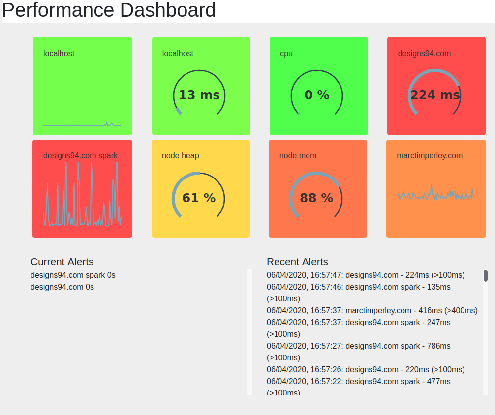

# dashboard
Performance measurement dashboard with configurable metrics and end-point monitoring. Ideally suited to API microservices.

## Getting Started

  1. Clone or download the project
  2. Modify the `measurements.json` as required (see below)
  3. Run `npm install` to get all the dependencies
  4. Run `npm start` to start the server
  5. Point the browser at the server (http://localhost:4000)

### Prerequisites

- node 10.x +
- npm 6.x +

### Configuring measurements.json

  - Edit the existing file
  - Any number of measurements can be added, but may impact performance and usability if you have too many
  - Existing measurements for local CPU and memory are included
  - You can measure the performance of any URL:
   - use `/api/proxy/url?url=www.example.com` as the url
   - use `response` as the value
  - If you want to record any other metric(s) from an API endpoint, create a new .js file in proxy as a copy of one of the existing files and include the metric(s) you want in the JSON response. The example `random_number.js` gets a random number from the remote CSRNG (https://csrng.net) site and parses the JSON response to display on the dashboard

  Each measurement has the following keys:

    "name": "designs94.com spark", // name of the chart

    "location": "board4", // location on the page

    "url": "/api/proxy/url?url=http://designs94.com", // url to call

    "value": "response", // value to get from JSON response [optional] [default: response time, ms]

    "chartType": "spark", // 'spark' line or 'gauge'
    
    "max": 300, // upper limit of chart [optional] [default:100]
    
    "threshold": 250, // alerting threshold [optional] [default:100]
    
    "data": [] //required for chartType = spark

## Using for your project

 - Follow the steps in _getting started_
 - Disconnect the git repo with `git init`
 - Add your own git repo using `git remote add origin [url]`
 - Push to your repo with `git push --set-upstream origin master`
 - Change the links in this readme.md file as required
 - Configure the measurements.json as needed
 
## Running the tests

To run the tests, jest must be installed.

- run `npm test` to execute the tests. Shipped tests include validation that routes are loaded and the application has been built correctly.

You are _strongly_ encouraged to write your own tests for any functionality and routes you develop. Check `__tests__/example.test.js` for an example.

## Contributing and Code of Conduct

Please read [CONTRIBUTING.md](CONTRIBUTING.md) for details on the code of conduct, and the process for submitting pull requests.

## Authors

* **Marc Timperley** - *Initial work*

## License

This project is licensed under the MIT License - see the [LICENSE.md](LICENSE.md) file for details

## ToDo

- [ ] Add css/scss
- [ ] Build interval per measurement
- [ ] Build all test cases
- [ ] Add security to web server front end
- [ ] Improve automation
- [ ] Test coverage
- [ ] Build admin UI
- [X] Move measurement config to JSON file
- [X] Display current alerts on dashboard
- [X] Build UI for alerts
- [ ] Write alerts to database
- [ ] Set up deployment pipeline
 

## Acknowledgments

*
